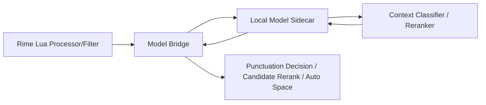

# 本地模型辅助输入架构设计

## 背景

当前项目的核心问题不是“能不能生成候选”，而是“在模糊场景下如何更像用户此刻想要的输入偏好”。

规则系统适合处理硬约束：

- URL、路径、邮箱、变量名、版本号保护
- 标点和空格的确定性兜底
- 输入法主链路的低延迟与可预测性

但规则系统不擅长处理这些模糊决策：

- 当前更像中文句子、英文句子，还是技术混输
- `hello?` 和 `先把 merge,` 的标点风格应如何分流
- 英文候选该不该在此刻排到中文候选前面
- 用户个人在不同 App、不同会话中的输入习惯

因此，本项目更适合引入一个 **本地模型辅助判别层**，而不是让模型直接取代 Rime 的词典与候选生成。

## 设计目标

1. 用户尽量忘掉中英文输入法切换。
2. 模型不进入破坏性路径，不直接生成最终输出文本。
3. 任意时刻都能退回到现有规则链路。
4. 所有推理与日志都留在本地。
5. 低延迟，不能破坏候选框稳定性。

## 非目标

- 不用模型直接生成中文候选
- 不把模型放进输入法主线程做阻塞推理
- 不依赖云端 API
- 不取消现有保护规则

## 总体思路

保留当前 Rime 链路：

```text
按键 -> Rime segmentor/translators -> 基础候选
```

在此基础上新增一个 **本地判别与重排 sidecar**：



关键原则：

- Rime 继续负责候选生成
- 本地模型只输出概率和分数
- Lua 侧只消费分数，不消费模型生成文本
- 低置信度时直接走规则兜底

## 模型应该预测什么

模型不预测“用户最终想输入哪一个字”，而是预测有限状态：

### 1. 上下文类型

- `zh_text`
- `en_text`
- `tech_mixed`
- `code_like`
- `protected`

### 2. 标点偏好

- `zh_punct_prob`
- `en_punct_prob`

### 3. 候选偏好

- `zh_candidate_boost`
- `en_candidate_boost`
- `tech_term_boost`

### 4. 自动空格偏好

- `space_before_zh_prob`
- `space_before_en_prob`

这意味着模型本质上是一个 **上下文分类器 + 候选 reranker**，不是自由生成器。

## 为什么不直接上“小参数大模型”

“本地小参数大模型”当然能做这件事，但在 IME 场景里，它不是第一优先：

- IME 延迟预算比聊天产品严得多
- 候选排序只需要有限状态和打分，不需要自由生成
- 保护规则必须保持确定性
- 候选链路一旦被阻塞，用户会立刻感知

所以推荐分三层：

1. `v1`：轻量分类器/打分器
2. `v2`：小型 reranker
3. `v3`：可选本地量化 LLM，仅用于难例重打分，不进主链路

## 架构拆分

### Lua 侧

保持当前组件职责不变，只新增桥接层：

- [hybrid_processor.lua](~/Desktop/developer/code/Hybrid-IME/lua/hybrid_processor.lua)
  - 记录已提交文本、当前 app、当前组合态输入
- [punctuation_processor.lua](~/Desktop/developer/code/Hybrid-IME/lua/punctuation_processor.lua)
  - 消费模型给出的标点偏好分数
- `future: lua/model_bridge.lua`
  - 负责与本地 sidecar 通信
- `future: lua/model_cache.lua`
  - 缓存最近一次预测结果，避免每个按键都发请求

### Sidecar 侧

建议作为独立本地进程运行，不嵌进 Lua：

- 长驻进程
- Unix Domain Socket 或本地 TCP 回环接口
- JSON request/response
- 超时控制
- 可替换模型后端

Sidecar 负责：

- 特征预处理
- 模型推理
- 本地缓存
- 日志记录与个性化更新

## 请求/响应协议

### 请求

```json
{
  "request_id": "uuid",
  "mode": "context_score",
  "app_id": "com.openai.codex",
  "recent_committed": "先把 PR merge",
  "current_input": "mer",
  "last_commit_text": "PR",
  "options": {
    "hybrid_mode": true,
    "auto_punct": true,
    "auto_space": true
  }
}
```

### 响应

```json
{
  "request_id": "uuid",
  "context": "tech_mixed",
  "confidence": 0.87,
  "scores": {
    "zh_prob": 0.22,
    "en_prob": 0.41,
    "tech_prob": 0.89,
    "zh_punct_prob": 0.74,
    "space_before_en_prob": 0.68
  },
  "ttl_ms": 800
}
```

### 候选重排请求

```json
{
  "request_id": "uuid",
  "mode": "candidate_rerank",
  "recent_committed": "先把这个 bug 修一下",
  "current_input": "merge",
  "candidates": [
    {"text": "合并", "type": "zh", "quality": 0.5},
    {"text": "merge", "type": "en", "quality": 0.4}
  ]
}
```

### 候选重排响应

```json
{
  "request_id": "uuid",
  "ranked_scores": [
    {"text": "merge", "score": 0.93},
    {"text": "合并", "score": 0.51}
  ],
  "confidence": 0.81
}
```

## 延迟预算

IME 场景必须强约束延迟：

- `context_score`：`p50 <= 8ms`, `p95 <= 15ms`
- `candidate_rerank`：`p50 <= 12ms`, `p95 <= 20ms`
- 超时：`20ms` 直接回退规则链路

因此需要：

- 进程常驻
- 小模型常驻内存
- 结果短时缓存
- 请求合并

## 回退策略

模型永远不是硬依赖。

### 必须直接绕过模型的场景

- URL / 路径 / 邮箱 / 变量名 / 版本号
- 当前正在 composing 且候选菜单尚未稳定
- 候选数过多且超时风险高
- sidecar 未启动
- sidecar 超时
- sidecar 返回低置信度

### 低置信度策略

- `confidence < 0.6`：完全回退规则
- `0.6 <= confidence < 0.8`：只影响轻量决策，例如标点
- `confidence >= 0.8`：允许影响候选重排

## 个性化学习

本地模型真正有价值的地方，在于利用用户的真实选择做个性化。

### 可以记录的反馈

- 当前上下文特征
- 候选列表
- 用户最终选择的候选
- 用户是否回删了自动标点
- 用户是否手动改成半角/全角
- 当前 App

### 本地存储原则

- 全部保留在本机
- 原始日志短期保存
- 训练样本可匿名化为特征与标签
- 用户可一键清空

## 建议的实现阶段

### Phase 0：观测与埋点

先不接模型，只做本地日志：

- 记录上下文
- 记录候选列表
- 记录用户最终选择
- 记录标点回改行为

目标：形成训练数据，不破坏现有体验。

### Phase 1：模型辅助标点

只做最安全的一个点：

- sidecar 输出 `zh_punct_prob`
- [punctuation_processor.lua](~/Desktop/developer/code/Hybrid-IME/lua/punctuation_processor.lua) 在模糊场景消费这个概率
- 保护规则仍然优先

目标：替代最脆弱的“英文尾词是否该跟中文标点”判断。

### Phase 2：模型辅助候选重排

新增一个更保守的重排器，不直接复用当前实验性的运行态 `hybrid_filter`：

- 保留现有词典生成
- 只对前 `N` 个候选做 rerank
- 仅在高置信度下改顺序
- 其余场景仍按原顺序展示

目标：让英文术语在正确上下文里自然上浮。

### Phase 3：模型辅助自动空格

只有在 Phase 1 和 Phase 2 稳定后才接：

- 由 sidecar 输出 `space_before_en_prob`
- 仅影响显示层
- 上屏后允许用户立刻回退

## 推荐的新模块

建议未来增加：

- `lua/model_bridge.lua`
- `lua/model_cache.lua`
- `lua/model_feature_extractor.lua`
- `tools/modeld/` 或 `cmd/modeld/`
- `tests/test_model_bridge.lua`
- `tests/test_model_rerank.lua`

## 当前结论

对这个项目来说，正确方向不是“把规则推翻，换一个本地小参数大模型”，而是：

- **规则负责确定性**
- **本地模型负责模糊判断**
- **Rime 负责候选生成**
- **sidecar 负责低延迟评分**

这是最接近“让用户忘掉切换中英文输入法”，同时又不破坏输入法稳定性的方案。
