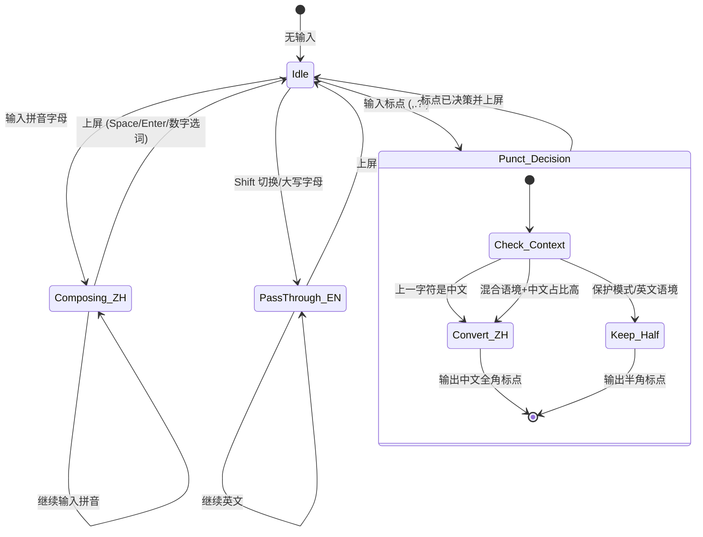

# 输入状态机设计文档

## 概述

程序猿输入法 不使用传统的"中文模式/英文模式"二元划分。取而代之的是一个基于 **Token 类型** 的上下文感知状态机。

## Token 类型定义

| Token 类型 | 标识符 | 示例 | 说明 |
|:-----------|:-------|:-----|:-----|
| 中文文本 | `zh_text` | 你好、世界 | 中文自然语言 |
| 英文文本 | `en_text` | hello, world | 普通英文 |
| 技术术语 | `tech_term` | React, Docker, API | 开发技术词汇 |
| 代码标识符 | `code_token` | user_id, refreshToken | 变量/函数/类名 |
| 命令 | `command_token` | --force, -v | CLI 参数 |
| 路径/URL | `path_or_url` | ~/Downloads, https://... | 文件路径和网址 |
| 数字 | `number_token` | 123, v1.2.3 | 数字和版本号 |
| 待决策标点 | `symbol_pending` | , . ? ! : ; | 需要上下文判断的标点 |
| 混合短语 | `mixed_phrase` | 这个 bug | 中英混合表达 |

## 状态机转换图



## 决策优先级

1. **保护模式** — 最高优先级，一票否决所有智能变换
2. **开关状态** — 用户可随时关闭任何智能功能
3. **App 策略** — 不同 App 有不同默认行为
4. **上下文分析** — 基于已提交文本进行语言判断
5. **默认保守** — 不确定时保留原始输入

## 保护模式触发条件

检测到以下模式时进入保护模式：

```
URL:      ^https?://  |  ^ftp://  |  ^mailto:
路径:      ^~/  |  ^./  |  ^../  |  ^/[a-z]
邮箱:      \w+@\w+\.\w+
命令参数:  ^--?\w
变量名:    snake_case  |  camelCase
版本号:    ^v?\d+\.\d+
```
